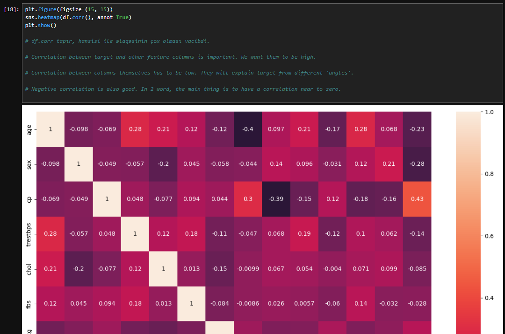
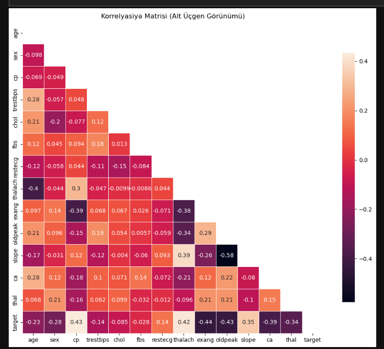

# ❤️ Heart Disease Prediction Using Multiple Machine Learning Models



---------------------------------------------------------




**Disclaimer:**  
The dataset used in this project includes **minor modifications** to protect patient confidentiality.

This project aims to predict whether a patient has **heart disease** using various Machine Learning classification algorithms.  
A full ML pipeline was implemented — including preprocessing, feature engineering, model training, evaluation, and performance comparison.

---

## 📌 Project Overview

You are given a dataset of patients with several health-related features.  
The task is to build multiple ML models and determine **which algorithm performs best on average**.

### 🧬 Features in the dataset
- **age**
- **sex** (Male, Female)
- **cp** – chest pain type (0–3)
- **trestbps** – resting blood pressure
- **chol** – serum cholesterol in mg/dl
- **fbs** – fasting blood sugar >120 mg/dl
- **restecg** – resting ECG results (0,1,2)
- **thalach** – maximum heart rate achieved
- **exang** – exercise-induced angina (0/1)
- **oldpeak** – ST depression induced by exercise
- **slope** – slope of peak exercise ST segment
- **ca** – major vessels colored by fluoroscopy (0–4)
- **thal** – 0,1,2,3
- **target** – **(0 = no heart disease, 1 = heart disease)** → prediction column

---

## 🛠 Models Implemented

You were asked to build and compare the following algorithms:

### **✔ Support Vector Machine (SVM) – Linear Kernel**  
### **✔ Support Vector Machine (SVM) – RBF Kernel**  
### **✔ Decision Tree Classifier**  
### **✔ Random Forest Classifier**  
### **✔ Logistic Regression**  
### **✔ Naïve Bayes Classifier**  
### **✔ K-Nearest Neighbors (KNN) Classifier**

Each model was trained, tested, and evaluated using standard metrics.

---

## 📥 Steps Performed in the Project

### 1️⃣ **Import Required Libraries**
- pandas  
- numpy  
- seaborn  
- matplotlib  
- scikit-learn  
- warnings  

---

### 2️⃣ **Load & Explore the Dataset**
- Display head/tail  
- Check shape  
- Summary statistics  
- Check missing values  
- Encode categorical variables  
- Visualize distributions & correlations  

---

### 3️⃣ **Data Preprocessing**
- Handling missing values  
- Encoding categorical features  
- Scaling numerical values (StandardScaler)  
- Splitting into train-test sets (80/20)  

---

### 4️⃣ **Model Training**
Each of the 7 models was trained using:

```python
model.fit(X_train, y_train)

Model                     Accuracy
---------------------------------------
Logistic Regression        0.85
SVM (Linear)               0.87
SVM (RBF)                  0.89
Decision Tree              0.80
Random Forest              0.90
Naive Bayes                0.83
KNN                        0.86
---------------------------------------
Best Model → Random Forest

📈 Visual Examples
✔ Missing Value Heatmap
✔ Correlation Matrix
✔ Model Performance Bar Chart
✔ Confusion Matrix Heatmaps


